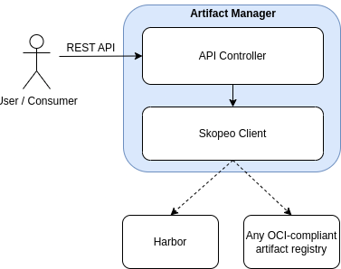

# Artefact Manager

**Work in Progress (WIP)**

This repository hosts the **Artefact Manager**, a service currently under active development. The Artefact Manager is responsible for managing artefacts, supporting operations such as retrieval and transfer.

## Architecture

The high-level architecture of the Artefact Manager is illustrated below:



## Deployment Options

You can run the Artefact Manager either **locally** or in a container-fashion with **Docker** or **Kubernetes**.

### 📦 Local Deployment (for development)

Ensure [`skopeo`](https://github.com/containers/skopeo) is installed on your system.

Then start the service with:

```bash
uvicorn src.api.api:app --reload
```

This will launch the FastAPI server with hot-reloading on code changes.

---

### 🐳 Docker-Based Deployment

#### 1. Build the Docker image

```bash
docker build -f deploy/Dockerfile -t artefact-manager:<TAG> .
```

#### 2. Run in development mode (hot-reload)

```bash
docker run -p 8000:8000 \
  -v $(pwd)/src:/app/src \
  -v $(pwd)/requirements.txt:/app/requirements.txt \
  -e PYTHONPATH=/app \
  artefact-manager:<TAG> \
  uvicorn src.api.api:app --host 0.0.0.0 --port 8000 --reload
```

#### 3. Run in production mode

```bash
docker run -d -p 8000:8000 \
  -e PYTHONPATH=/app \
  --name artefact-manager \
  artefact-manager:<TAG>
```

---

### ☸️ Kubernetes-Based Deployment

You can also deploy the Artefact Manager in a Kubernetes cluster using the provided manifests.

#### 1. Create the namespace

```bash
kubectl create namespace artefact-manager
```

#### 2. Deploy the application

```bash
kubectl create -f deploy/k8s-manifests.yaml
```

This will create a Deployment and expose the service via a `NodePort` on port `30080`. You can access it using:

```
http://<NODE_IP>:30080
```
## Contributing

We welcome contributions! Please follow these steps:

1. Read the [contribution guidelines](docs/CONTRIBUTING.md).
2. Create a new branch using the appropriate naming convention.
3. Implement your feature or fix inside the correct directory.
4. Ensure all tests pass locally before submitting.
5. Open a Merge Request (MR) against the `main` branch.
