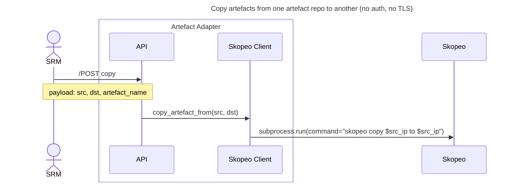

```mermaid
sequenceDiagram
title Copy artefacts from one artefact repo to another (no auth, no TLS)
actor SRM
box Artefact Adapter
    participant API
    participant SCL as Skopeo Client
end
participant Skopeo

SRM ->> API: /POST copy
note over SRM,API: payload: src, dst, artefact_name

API ->> SCL: copy_artefact_from(src, dst)

SCL ->> Skopeo: subprocess.run(command="skopeo copy $src_ip to $src_ip")
```